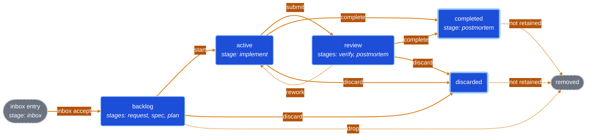

# TCW — Taxonomy · Capabilities · Work

TCW keeps three things about a software project inside the repository, next to
the code: what the project deals with, what a user can do with it, and what is
being changed. One command-line tool, `tcw`, and an agent plugin for Claude Code
and Codex keep all three in step with the code.

| Component        | Answers                                                 |
| ---------------- | ------------------------------------------------------- |
| **Taxonomy**     | What things does this project deal with?                |
| **Capabilities** | What can a user do with those things?                   |
| **Work**         | What are we changing, and where does each change stand? |

## Contents

- [Problem Statement](#problem-statement)
- [Installation](#installation)
    - [Plugin](#plugin)
    - [CLI](#cli)
    - [Cloud Environment Instructions](#cloud-environment-instructions)
- [Overview](#overview)
- [Taxonomy](#taxonomy)
    - [Overview](#overview-1)
    - [Usage](#usage)
- [Capabilities](#capabilities)
    - [Overview](#overview-2)
    - [Usage](#usage-1)
- [Work](#work)
    - [Overview](#overview-3)
    - [Lifecycle](#lifecycle)
    - [Usage](#usage-2)
- [Skills and Agents](#skills-and-agents)
- [TCW Local Web App](#tcw-local-web-app)
- [Documentation](#documentation)
- [Development](#development)
    - [Setting up](#setting-up)
    - [Running the tests](#running-the-tests)
    - [How work is tracked here](#how-work-is-tracked-here)
    - [Measuring the skill layer](#measuring-the-skill-layer)
    - [Releasing](#releasing)
    - [Reporting problems](#reporting-problems)
    - [License](#license)
- [Further Reading](#further-reading)

## Problem Statement

Ask three people at a company with twenty repositories what one of those
repositories does, what a user can do with it, and what is being changed in it
right now. You get three different answers, assembled from four different places:
a ticket tracker that knows about work but not about the product, a wiki whose
glossary was last edited two years ago, a `FOLLOWUPS.md` that only grows, and
design documents that stopped matching the code some time back.

None of those places is wrong on purpose. They drift because none of them sits
next to the code, and nothing makes them move when the code moves.

TCW puts all three in the repository. One commit carries a code change and the
description of what it changed, and a reviewer sees both in the same diff.

## Installation

### Plugin

In **Claude Code**:

```
/plugin marketplace add brocef/TCW
/plugin install tcw
```

Or, in the Claude **web app** or **desktop app**, open the plugin directory, add
`brocef/TCW` as a marketplace, and install `tcw` from it — no terminal needed.

**Then start a new session.** The plugin installs the `tcw` CLI at session start
by installing `tcw-cli` from PyPI with `pipx`, so one installed mid-session
cannot run until the next one begins. That first session needs network access. It
installs over an existing `pipx install tcw-cli` rather than beside it, and
leaves a development checkout (`pip install -e .`) alone. If `tcw` goes missing
anyway, `pipx install tcw-cli` is the whole fix — the **`tcw-setup`** skill
carries the cases where it is not.

In **Codex**:

```bash
codex plugin marketplace add brocef/TCW --ref main
codex plugin add tcw@tcw
```

Codex has no session-start hook, so ask the agent to run the **`tcw-setup`**
skill — it runs the same install script Claude runs automatically.

The plugin ships the skills and read-only review agents described in
[Skills and Agents](#skills-and-agents).

### CLI

```sh
pipx install tcw-cli
```

Use this when you want the CLI without an agent harness at all. The PyPI package
is named **`tcw-cli`** because `tcw` was taken by an unrelated project; the
command it installs is still `tcw`.

Requires **Python ≥ 3.11** (its only runtime dependency is PyYAML). `tcw serve`
additionally requires **Node.js ≥ 22.12**; every other command is Python-only.
Released wheels carry the prebuilt web assets, so there is no frontend build step
and no network needed after install.

### Cloud Environment Instructions

A cloud agent session — Claude Code on the web, a Codex cloud task, a CI job —
starts from a clean image and is thrown away when it ends, so a `tcw` you install
by hand is gone by the next one. Install it as part of the environment's own
setup, and every session gets it without anyone remembering to.

**Claude Code on the web.** Add a script to your repository:

```sh
#!/usr/bin/env bash
# Make `tcw` available in a disposable agent container.
# Exit 0 on every path — a session must start even when this cannot finish.
set -u

command -v tcw >/dev/null 2>&1 && exit 0

# pipx where it exists; otherwise install into the container's own interpreter.
# That is the right answer *here* and nowhere else: the container is disposable
# and single-purpose, so there is no user environment to damage.
if command -v pipx >/dev/null 2>&1; then
    pipx install tcw-cli >/dev/null 2>&1 || echo "tcw: pipx install tcw-cli failed"
elif ! python3 -m pip install tcw-cli >/dev/null 2>&1 &&
    ! python3 -m pip install tcw-cli --break-system-packages >/dev/null 2>&1; then
    echo "tcw: pip install tcw-cli failed — the tcw CLI is not available."
fi

# An install that landed outside PATH is installed and unusable. $CLAUDE_ENV_FILE
# is the harness's own channel for repairing that.
if ! command -v tcw >/dev/null 2>&1 && [ -n "${CLAUDE_ENV_FILE:-}" ]; then
    userbin="$(python3 -m site --user-base 2>/dev/null)/bin"
    [ -x "$userbin/tcw" ] && echo "export PATH=\"$userbin:\$PATH\"" >>"$CLAUDE_ENV_FILE"
fi

exit 0
```

Then wire it to `SessionStart` in your repository's `.claude/settings.json`:

```json
{
    "hooks": {
        "SessionStart": [
            {
                "hooks": [
                    {
                        "type": "command",
                        "command": "\"${CLAUDE_PROJECT_DIR}\"/scripts/tcw_session_setup.sh"
                    }
                ]
            }
        ]
    }
}
```

Three things make the difference between a hook that helps and one that wastes a
session:

- **Exit 0 on every path, and print only on failure.** A hook that fails the
  session start over a missing CLI has cost more than the CLI was worth.
- **Print to stdout.** Claude Code adds a `SessionStart` hook's stdout to the
  agent's context, where it will be read; stderr becomes a transcript notice
  nobody sees.
- **Check for `tcw` first.** The hook runs every session, including the ones
  where a previous install is still there.

**Codex cloud.** A Codex cloud environment does not read a hook from your
repository. Its install steps go in the environment's **setup script**, which you
set in the environment's settings. Two things differ from Claude Code:

- **The setup script has internet access; the agent does not, by default.**
  Install `tcw` in the setup script, not by asking the agent to do it later.
- **The setup script runs in its own shell**, so an `export` there never reaches
  the agent. Repair `PATH` by writing to `~/.bashrc` instead.

```sh
if ! command -v tcw >/dev/null 2>&1; then
    if command -v pipx >/dev/null 2>&1; then
        pipx install tcw-cli
    else
        python3 -m pip install tcw-cli || python3 -m pip install tcw-cli --break-system-packages
    fi
fi

# An install that landed outside PATH: make the agent's shell find it.
userbin="$(python3 -m site --user-base 2>/dev/null)/bin"
if ! command -v tcw >/dev/null 2>&1 && [ -x "$userbin/tcw" ]; then
    echo "export PATH=\"$userbin:\$PATH\"" >>~/.bashrc
fi
```

**If your work store lives in another repository**, the container holds only the
repository it cloned, so its work items are declared but absent. Run `tcw provision`
after the install — it obtains what the checkout does not have, and does nothing
on a machine that already holds it. See
[Working across repositories](docs/guide/multi-repo.md).

Installing the **plugin** in a Claude Code session is a separate step from
installing the CLI, and only needed where the harness does not carry your plugins
in: append `claude plugin marketplace add brocef/TCW` and
`claude plugin install tcw@tcw` to the same script, guarded on `command -v claude`.

## Overview

TCW describes a project along three axes. **Taxonomy** is the project's
vocabulary and its features. **Capabilities** are the things a user can do,
each with a status. **Work** is the set of changes being made, each moving through
a lifecycle. The three link by one-directional pointers: a capability names the
taxonomy entries it involves, and a work item names the capabilities it changes.
None of them copies another's content.

Everything is plain files in the repository, so a code change and the
description of what it changed travel in the same commit and the same pull
request. A work item's status is the folder it sits in, so there is no separate
list to fall out of step. Each item is addressed by its **slug**, a dated short
name such as `2026-09-15-export-invoices-as-pdf`.

**One command-line tool, `tcw`**, does everything:

| Command            | What it does                                                                  |
| ------------------ | ----------------------------------------------------------------------------- |
| `tcw init`         | marks a directory as a TCW project and creates the folders for each axis      |
| `tcw provision`    | fetches a work store this project declares but this machine does not have     |
| `tcw validate`     | checks every file, reference and link across the project and its sub-projects |
| `tcw serve`        | starts a local web app for browsing and editing all three axes                |
| `tcw taxonomy`     | the vocabulary and features                                                   |
| `tcw capabilities` | what a user can do                                                            |
| `tcw work`         | the changes, and the lifecycle each one follows                               |

A repository adopts TCW with one command, run inside a git repository:

```sh
tcw init --id my-project                # all three axes
tcw init --id my-project taxonomy work  # …or only some of them
```

That writes a `tcw-config.yaml` holding the project's ID and creates the folders
under `docs/`. A project can adopt the work axis alone and add the others later.
`tcw validate` exits non-zero on any problem, so it works as a check in CI.

**The CLI enforces the rules; the agent plugin supplies the judgment.** Legal
status changes, references that must resolve, and the checks before an item can
be completed are enforced by `tcw` itself. Deciding what a request means, writing
a spec, or judging whether work is finished is what the plugin's skills guide an
agent through. See [Skills and Agents](#skills-and-agents).

**Many repositories, one model.** Projects are identified by ID, never by path.
A project can connect to others, inherit their taxonomy and capabilities, and
address their work items as `<project-id>/<slug>`. A checkout holding only some of
the connected repositories still works: the absent ones drop out rather than
breaking your commands. See [Working across repositories](docs/guide/multi-repo.md).

## Taxonomy

### Overview

A taxonomy entry has one of two kinds. **Vocabulary** entries are the project's
basic language: `Invoice`, `Customer`, `Permission`. **Feature** entries are the
user- or application-facing parts that operate on that vocabulary, and each names
the vocabulary entries it involves. A feature can only name vocabulary that
already exists, so vocabulary is registered first.

Entries form a tree, and an entry's path is its address: `admin/permission` and
`billing/permission` are two different entries.

A project can **inherit** another project's taxonomy. Inherited entries keep the
other project's ID as a prefix, so an inherited `acme/permission` never quietly
becomes your own `permission`.

### Usage

#### Skills

| Skill                                          | What it does                                                                                              |
| ---------------------------------------------- | --------------------------------------------------------------------------------------------------------- |
| [`tcw-taxonomy`](skills/tcw-taxonomy/SKILL.md) | Guides an agent through declaring vocabulary and features, linking them, and resolving inherited entries. |

To draft a first taxonomy from an existing codebase, use the `tcw-setup` skill
described in [Skills and Agents](#skills-and-agents).

#### CLI

| Command                | What it does                                                          |
| ---------------------- | --------------------------------------------------------------------- |
| `tcw taxonomy init`    | creates `docs/taxonomy/` (the same as `tcw init taxonomy`)            |
| `tcw taxonomy list`    | shows every entry as a tree, marked by kind and by where it came from |
| `tcw taxonomy add`     | creates a vocabulary entry or a feature                               |
| `tcw taxonomy show`    | prints one entry                                                      |
| `tcw taxonomy path`    | prints the folder the taxonomy is stored in                           |
| `tcw taxonomy rm`      | removes a local entry                                                 |
| `tcw taxonomy search`  | searches entry names and descriptions                                 |
| `tcw taxonomy check`   | checks that every reference and inherited project resolves            |
| `tcw taxonomy extends` | adds or removes a project whose taxonomy this one inherits            |

```sh
tcw taxonomy add Invoice "A bill issued to a customer."   # vocabulary by default
tcw taxonomy add Admin "Running the service."
tcw taxonomy add Permission -p admin                      # → admin/permission
tcw taxonomy add "PDF Export" --kind feature --vocab invoice
tcw taxonomy list
tcw taxonomy extends add acme-shared                      # inherit another project
```

More in [Taxonomy and Capabilities](docs/guide/taxonomy-and-capabilities.md).

## Capabilities

### Overview

A capability is one thing a user can do, such as "Download an invoice as PDF".
Each is addressed by a path (`billing/invoices`), gets a stable ID when created,
and carries a **status**: `Supported`, `Partial`, `Missing`, `Blocked` or
`Omitted`. The status is what makes the list useful: it says what the product
actually does today, and completing a work item is how a capability moves from
`Missing` to `Supported`.

Capabilities can be **inherited** from another project. A web frontend and a
mobile app that drive the same server declare their shared capabilities once, and
each **overrides** only what differs, for example marking one `Omitted` or adding
to its description. An override can be undone to go back to the inherited
version.

#### Relationship to Taxonomy

A capability points at taxonomy, never the other way. Its `Subject` field names
the vocabulary entries it involves (any number of them), and its `Feature` field
names the taxonomy feature that delivers it. TCW checks that both resolve, and
refuses to save a capability whose references do not, so a feature is
registered in the taxonomy before a capability names it.

### Usage

#### Skills

| Skill                                                  | What it does                                                                                                                                                          |
| ------------------------------------------------------ | --------------------------------------------------------------------------------------------------------------------------------------------------------------------- |
| [`tcw-capabilities`](skills/tcw-capabilities/SKILL.md) | Guides an agent through checking a planned change against the existing capabilities, catching contradictions, and updating a capability's status when work completes. |

#### CLI

| Command                    | What it does                                                                                |
| -------------------------- | ------------------------------------------------------------------------------------------- |
| `tcw capabilities init`    | creates `docs/capabilities/` (the same as `tcw init capabilities`)                          |
| `tcw capabilities list`    | lists capabilities, marked by status and by where they came from                            |
| `tcw capabilities show`    | prints one capability                                                                       |
| `tcw capabilities path`    | prints the folder capabilities are stored in                                                |
| `tcw capabilities add`     | creates a capability                                                                        |
| `tcw capabilities set`     | changes a capability's status or fields; on an inherited one, writes an override            |
| `tcw capabilities reset`   | removes a local override, going back to the inherited version                               |
| `tcw capabilities rm`      | removes a local capability                                                                  |
| `tcw capabilities search`  | searches names and descriptions                                                             |
| `tcw capabilities extends` | adds or removes a project whose capabilities this one inherits                              |
| `tcw capabilities check`   | checks paths, fields, taxonomy references and inheritance                                   |
| `tcw capabilities drift`   | reports inherited capabilities nobody has reviewed, and shipped work still marked `Missing` |

```sh
tcw capabilities add billing/invoices "Download an invoice as PDF"
tcw capabilities set billing/invoices --field "Subject=invoice" --field "Feature=pdf-export"
tcw capabilities list --status Missing
tcw capabilities set billing/invoices --status Supported
tcw capabilities extends web-frontend                    # inherit another project
```

More in [Taxonomy and Capabilities](docs/guide/taxonomy-and-capabilities.md).

## Work

### Overview

The work axis tracks every change being made to the project: new product
behavior, changes to its internals, or changes to how the project itself runs.

- **A work item is a folder**, `docs/work/<status>/<slug>/`, holding the
  documents written for it as it moves along. **Its status is the folder it is
  in**: moving an item is a `git mv`, and `ls docs/work/active/` is the board of
  what is in progress. By default, every status change commits itself.
- **Requests start in an inbox.** A raw request dropped into `docs/work/inbox/`,
  by a person or by another project, becomes a work item when it is accepted.
  A Jira ticket can instead become an item directly (see
  [Jira integration](#jira-integration)).
- **Tags** come from a list the project registers (`tcw work tags`), so a typo
  never quietly creates a new tag.
- **Blockers** are recorded on an item (`tcw work edit --blocked-by`). An item
  with an unresolved blocker cannot start, or be completed as done, without
  `--force`; there is no separate "blocked" status.
- **Large items split.** A child item lives inside its parent's folder and moves
  with it. An **epic** groups related items, including items in other
  repositories, and reports their combined status.
- **Completing is checked.** `tcw work complete` prints the project's Definition
  of Done (a list you set in `docs/work/dod.yaml`) and refuses until you confirm
  it, while blockers are unresolved, or while declared capability changes are not
  yet made.
- **Code can be isolated.** `tcw work start --worktree` gives the item its own git
  branch and worktree, and `complete` merges it back.

The full reference, including every command's options, is
[The Work component](docs/guide/work.md).

#### Relationship to Capabilities and Taxonomy

A work item that changes what a user can do says so in a `capabilities.yaml` file
in its folder, listing capability paths under `new:`, `changed:` and `removed:`.
That is the pointer from work to capabilities. `tcw work complete` refuses while
a capability listed as `new:` is still `Missing`, a listed path does not exist,
or a `removed:` capability is still there. So the capabilities list always
describes what has actually shipped.

Work reaches taxonomy through those capabilities: a new capability names the
vocabulary and feature it involves, and those entries must exist first. The
planning skills check both, in that order (vocabulary, then features, then
capabilities, then the work itself), before a change is designed.

### Lifecycle

TCW's lifecycle has two separate parts. **Stages** produce documents: `request`
writes `initial-request.md`, `spec` writes `spec.md`, and so on. **Transitions**
move an item from one status to another. Nothing is both. In words: an inbox
entry is accepted into the backlog, where the request, spec and plan are written;
`start` moves it to active for implementation; `submit` moves it to review for
verification, from which `rework` can send it back; and `complete` finishes it as
completed, or as discarded if it will not ship.



The stages, and the document each one writes:

| Stage        | Runs while the item is | Writes                                                            |
| ------------ | ---------------------- | ----------------------------------------------------------------- |
| `inbox`      | not yet an item        | nothing; it creates the item, keeping the raw text as `intake.md` |
| `request`    | backlog                | `initial-request.md`: what is asked for, and why                  |
| `spec`       | backlog                | `spec.md`: what to build, with acceptance criteria                |
| `plan`       | backlog                | `plan.md`: how to build it, as ordered tasks                      |
| `implement`  | active                 | `outcome.md`: what was built, and what the plan got wrong         |
| `verify`     | review (or active)     | `refined-outcome.md` if accepted, `rework.md` if not              |
| `postmortem` | review or completed    | `post-mortem.md`: which stage could first have caught a problem   |

The transitions, and what each one checks before it moves an item:

| Transition   | Command                                                                          | Moves                                 | Refuses when                                                                                                                              |
| ------------ | -------------------------------------------------------------------------------- | ------------------------------------- | ----------------------------------------------------------------------------------------------------------------------------------------- |
| `start`      | `tcw work start <slug>`                                                          | backlog → active                      | a blocker is unresolved; the item belongs to an epic that is not active                                                                   |
| `submit`     | `tcw work submit <slug>`                                                         | active → review                       | never                                                                                                                                     |
| `rework`     | `tcw work rework <slug>`                                                         | review → active                       | `refined-outcome.md` is present (it says the work was accepted)                                                                           |
| `complete`   | `tcw work complete <slug> --resolution done --confirm`                           | review or active → completed          | a blocker is unresolved; an epic has open children; declared capabilities are not reconciled; a worktree merge-back fails; no `--confirm` |
| discard      | `tcw work complete <slug> --resolution wontfix\|duplicate\|superseded --confirm` | backlog, active or review → discarded | no `--confirm`                                                                                                                            |
| `drop`       | `tcw work drop <slug> --confirm`                                                 | backlog → removed                     | the item is not in backlog; no `--confirm`                                                                                                |
| not retained | happens during `complete` or discard                                             | completed or discarded → removed      | only happens when `work.retain` says that status is not kept; `tcw work delete` finishes one that was interrupted                         |

`review` means implemented but not yet accepted: an item in review still blocks
the items that depend on it. `rework` is the only move backwards, and nothing ever
leaves `completed` or `discarded`.

A project can attach its own instructions and checks to any stage or transition,
such as a design rule read at `spec` or `tcw validate` run before `complete`. See
[Configuration](docs/guide/configuration.md). `tcw work lifecycle` prints the
whole contract, with whatever the project has attached.

#### Jira integration

A project can name the Jira Cloud site its team works from. Tickets can then
become work items, and a ticket linked to an item follows it through the
lifecycle. None of the stages change: Jira attaches to how an item is created and
to the transitions.

| Lifecycle step                          | Without Jira                   | With Jira configured                                                                                                                           |
| --------------------------------------- | ------------------------------ | ---------------------------------------------------------------------------------------------------------------------------------------------- |
| an item is created                      | `tcw work inbox accept`, `new` | `tcw work tracker import <ticket>` claims the ticket (starts it and assigns it to you), then creates a backlog item whose intake is the ticket |
| `request`, `spec`, `plan` stages        | unchanged                      | unchanged                                                                                                                                      |
| at any time                             | —                              | `tcw work tracker link` / `unlink` records or removes the link between an existing item and a ticket; Jira itself is not touched               |
| `start`                                 | moves the item                 | also claims a linked ticket, and posts a comment if `comments: true`                                                                           |
| `submit`, `rework`, `complete`, discard | moves the item                 | also moves a linked ticket to the Jira status mapped under `statuses`, and posts a comment if `comments: true`                                 |
| the ticket could not follow             | —                              | the item still moves; the command exits 1 and records the ticket as pending or conflicting; `tcw work tracker sync` retries                    |

Setting `strict: true` changes several steps, so that no work happens without a
claimed ticket:

- `tcw work new` (except `--epic`) and `inbox accept` are refused, and point you at
  `tcw work tracker import`.
- `start` refuses an item with no ticket. For a linked item it claims the ticket
  first, and moves the item only if the claim worked.
- `submit`, `rework` and `complete --resolution done` read the ticket first, and
  refuse unless it is assigned to you and where the item's last move left it.
- Discarding is always allowed. `drop` refuses an item that was ever linked, so
  the record stays.
- While Jira cannot be reached, those commands refuse, and `tcw serve` refuses
  the same changes.

A minimal configuration, in the project's `tcw-config.yaml`:

```yaml
work:
    tracker:
        provider: jira-cloud
        base-url: https://yourcompany.atlassian.net
        candidate-query: assignee = currentUser() AND status = "To Do"
        credentials:
            email-env: TCW_JIRA_EMAIL
            token-env: TCW_JIRA_API_TOKEN
        transitions: { claim: Start Progress }
        statuses: { active: In Progress, review: In Review, completed: Done }
```

The credentials entries hold the **names** of environment variables, never the
e-mail address or token themselves.

**Example 1: taking a ticket from import to completion.**

```sh
tcw work tracker list                  # TCW: lists tickets the query selects.   Jira: unchanged
tcw work tracker import ENG-482         # TCW: creates a backlog item.            Jira: ENG-482 → In Progress, assigned to you
#   …the request, spec and plan stages run as usual…
tcw work start <slug>                   # TCW: backlog → active.                  Jira: confirms the claim import made
tcw work submit <slug>                  # TCW: active → review.                   Jira: ENG-482 → In Review
tcw work complete <slug> --resolution done --confirm
                                        # TCW: review → completed.                Jira: ENG-482 → Done
```

**Example 2: linking an item that already exists.**

```sh
tcw work new "Speed up the checkout page"  # TCW: creates a backlog item.         Jira: unchanged
tcw work tracker link <slug> ENG-517       # TCW: records the link.               Jira: unchanged; the ticket keeps its assignee
tcw work start <slug>                      # TCW: backlog → active.               Jira: if unassigned or yours, ENG-517 → In Progress, assigned to you
```

**Example 3: the same project with `strict: true`.**

```sh
tcw work new "Speed up the checkout page"
# tcw work new: refused under strict tracker mode; nothing was created.
#   Create work from a ticket with `tcw work tracker import <ticket>`.
tcw work tracker import ENG-517        # the only way to create the item
tcw work start <slug>                  # claims first; starts only if the claim worked
```

Configuration, settings shared from a parent project, what `tracker show`
reports, comments, and the known limits are in
[Working from Jira](docs/guide/jira.md).

### Usage

#### Skills

| Skill                                                | What it does                                                                                                                                                                                  |
| ---------------------------------------------------- | --------------------------------------------------------------------------------------------------------------------------------------------------------------------------------------------- |
| [`work`](skills/work/SKILL.md)               | Guides an agent through the whole work lifecycle: triaging the inbox, writing the request, spec and plan, implementing, verifying, completing, splitting large items, and coordinating epics. |
| [`tcw-post-mortem`](skills/tcw-post-mortem/SKILL.md) | Once a problem has surfaced (rejected work, a false claim in a spec, something shipped that should not have), finds which lifecycle stage could first have caught it.                         |
| [`tcw-work-create`](skills/tcw-work-create/SKILL.md) | Turns an idea for a piece of work into a work item, or adds it to the item or inbox entry that already covers it, after checking what is already tracked.                                     |

Most day-to-day work starts from one of the command skills (planning an item,
driving it to completion, verifying it, processing the inbox) described in
[Skills and Agents](#skills-and-agents).

#### CLI

**Board and items**

| Command         | What it does                                                   |
| --------------- | -------------------------------------------------------------- |
| `tcw work new`  | creates a backlog item and prints its slug                     |
| `tcw work list` | shows the board; completed and discarded items only when asked |
| `tcw work show` | prints an item's status, fields and documents                  |
| `tcw work path` | prints the work store's folder, or an item's folder            |
| `tcw work edit` | changes an item's title, estimates, tags or blockers           |
| `tcw work tags` | lists, adds or removes the project's registered tags           |

**Transitions**

| Command             | What it does                                                                      |
| ------------------- | --------------------------------------------------------------------------------- |
| `tcw work start`    | backlog → active                                                                  |
| `tcw work submit`   | active → review: implemented, waiting for acceptance                              |
| `tcw work rework`   | review → active: verification rejected the work                                   |
| `tcw work complete` | closes an item: `--resolution done` → completed, any other resolution → discarded |
| `tcw work drop`     | deletes a backlog item outright                                                   |
| `tcw work delete`   | finishes removing a resolved item the project does not keep                       |

**Lifecycle stages**

| Command              | What it does                                                                              |
| -------------------- | ----------------------------------------------------------------------------------------- |
| `tcw work lifecycle` | prints every stage and transition, with what this project attaches to each                |
| `tcw work stage`     | `stage gate` checks a stage may run; `stage prompt` prints its instructions               |
| `tcw work scaffold`  | writes a draft of a stage's document from its template                                    |
| `tcw work docs`      | prints the project's documentation entries: which documents a change must keep up to date |

**Inbox, and work across projects**

| Command              | What it does                                                      |
| -------------------- | ----------------------------------------------------------------- |
| `tcw work inbox`     | `inbox list`, `inbox show` and `inbox accept` raw requests        |
| `tcw work nodes`     | lists this project's parent and child projects                    |
| `tcw work delegate`  | writes a request into a child project's inbox                     |
| `tcw work escalate`  | writes a request into the parent project's inbox                  |
| `tcw work reconcile` | reads child projects' items and writes an epic's rolled-up status |

**Jira and housekeeping**

| Command              | What it does                                                                                                  |
| -------------------- | ------------------------------------------------------------------------------------------------------------- |
| `tcw work tracker`   | `list`, `show`, `import`, `link`, `unlink` and `sync` against Jira; see [Jira integration](#jira-integration) |
| `tcw work init`      | creates the work store's folders (the same as `tcw init work`)                                                |
| `tcw work tombstone` | records items resolved before the store kept a record of them, so their slugs are never reused                |

```sh
tcw work new "Export invoices as PDF"          # → 2026-09-15-export-invoices-as-pdf
tcw work start 2026-09-15-export-invoices-as-pdf
tcw work list
tcw work complete 2026-09-15-export-invoices-as-pdf --resolution done --confirm
```

Every command has `--help`, and the full reference is
[The Work component](docs/guide/work.md).

## Skills and Agents

The CLI enforces the rules: which moves are legal, which references must
resolve, what has to be true before an item completes. What a command cannot
decide (what a request really asks for, whether a spec is good enough, whether
the work is finished) is judgment, and the plugin's skills guide an agent through
it. Skills name `tcw` commands and never reimplement them. Every entry point is a
skill, so they work the same way under Claude Code and Codex.

The skills for a single axis are listed in that axis's section above. These cut
across the axes.

**Setting up and configuring**

| Skill                                                      | What it does                                                                                                                                                                                |
| ---------------------------------------------------------- | ------------------------------------------------------------------------------------------------------------------------------------------------------------------------------------------- |
| [`tcw-setup`](skills/tcw-setup/SKILL.md)                   | Gets TCW working: installs or repairs the CLI, starts using TCW in a repository, sets up a project on a new machine, and drafts a first taxonomy or capabilities list from existing code.   |
| [`tcw-configure`](skills/tcw-configure/SKILL.md)           | Changes a working project's configuration: what runs at each stage or transition, the Definition of Done, documentation entries, Jira, where stores live, connected and inherited projects. |
| [`documentation-sync`](skills/documentation-sync/SKILL.md) | Decides which documents a finished change must update (README, changelogs, release notes, guides, skills), and offers a version bump when work is done.                                     |
| [`tcw-work-stage`](skills/tcw-work-stage/SKILL.md)         | Reads one lifecycle stage in a single step: the stage's own instructions together with whatever this project adds to them.                                                                  |

**Command skills: the everyday workflows**

| Skill                                                                                            | What it does                                                                                                    |
| ------------------------------------------------------------------------------------------------ | --------------------------------------------------------------------------------------------------------------- |
| [`tcw-commands-process-inbox`](skills/tcw-commands-process-inbox/SKILL.md)                       | Turns raw inbox entries into work items and writes each one's request.                                          |
| [`tcw-commands-plan-work`](skills/tcw-commands-plan-work/SKILL.md)                               | Takes an item, or a request made in chat, through the request, spec and plan stages, and stops before any code. |
| [`tcw-commands-drive-work-to-completion`](skills/tcw-commands-drive-work-to-completion/SKILL.md) | Takes an item from wherever it is through implementation, and stops for your verification before completing it. |
| [`tcw-commands-verify-work`](skills/tcw-commands-verify-work/SKILL.md)                           | Checks finished work against its spec with you, and records whether it was accepted or needs rework.            |

**Extras: optional, built for one way of working**

| Skill                                                                      | What it does                                                                                                        |
| -------------------------------------------------------------------------- | ------------------------------------------------------------------------------------------------------------------- |
| [`tcw-extras-autonomous-work`](skills/tcw-extras-autonomous-work/SKILL.md) | Drives work items to completion unattended, asking two read-only advisors wherever the lifecycle would ask you.     |
| [`tcw-extras-triage-issues`](skills/tcw-extras-triage-issues/SKILL.md)     | Works through **your** project's GitHub issues and turns the ones worth doing into work items.                      |
| [`tcw-extras-report`](skills/tcw-extras-report/SKILL.md)                   | Files a bug report or suggestion about TCW itself on [this project's issues](https://github.com/brocef/TCW/issues). |

**Agents.** Three read-only agents ship with the plugin. None of them edits a
file or moves an item; each reports back to the session that started it.

| Agent                 | What it does                                                                                                                                     |
| --------------------- | ------------------------------------------------------------------------------------------------------------------------------------------------ |
| `tcw-verifier`        | For the `verify` stage: reads the change against the item's spec, runs checks, and reports whether each acceptance criterion is met.             |
| `tcw-backlog-auditor` | Checks one backlog item for problems: already done, out of date, in the wrong project, not actionable, or blocked by something already resolved. |
| `tcw-post-mortem`     | Reads an item's documents and commit history backwards to find which stage could first have caught a problem.                                    |

## TCW Local Web App

`tcw serve` starts a local web app for browsing and editing all three axes, as an
alternative to the command line.

```sh
tcw serve              # http://127.0.0.1:8765/, and opens a browser
tcw serve --no-open    # start without opening a browser
tcw serve --port 9000  # use a different port
```

- **Requirements.** Node.js 22.12 or newer. The web app's files come prebuilt
  inside the Python package, so it works offline and needs no build step.
- **What you see.** Tabs for the taxonomy tree, the capabilities list and the work
  board, with filters, sorting and a text search. The address bar follows the view
  (`/taxonomy`, `/work/<slug>`, …), so any page can be bookmarked or shared, and
  any `tcw://` reference in a document is a link to its target.
- **What you can change.** Create and edit taxonomy entries, capabilities and work
  items, including an item's request, spec, plan and other documents, in a
  Markdown editor with a live preview. Saving runs the same validation rules as
  the CLI and shows any problems.
- **Lifecycle actions.** The app can `start`, `complete` and `drop` an item;
  `complete` also covers discarding. For `submit` and `rework`, use the CLI.
- **It runs no lifecycle hooks.** Checks a project attaches to a transition run
  from the CLI only, so a move made in the app skips them. Moves made in the app
  are also not sent to Jira.
- **Several projects.** When the project has child projects, their boards are
  shown alongside its own, with items addressed as `<project-id>/<slug>`.
- **Local only.** The server listens only on `127.0.0.1`. Requests that change
  anything must name a local address (`127.0.0.1`, `localhost` or `::1`) and send
  JSON, which blocks other websites
  from making changes through your browser, and two people editing the same object
  cannot silently overwrite each other.
- **If it fails to start**, check `node --version` is at least `v22.12.0`, and
  try `--port` with a free port.

Everything else about the app is in
[The local web viewer](docs/guide/web-viewer.md).

## Documentation

| Document                                                             | Covers                                                                                                                                                                                                                                                                                                                                                                            |
| -------------------------------------------------------------------- | --------------------------------------------------------------------------------------------------------------------------------------------------------------------------------------------------------------------------------------------------------------------------------------------------------------------------------------------------------------------------------- |
| [Configuration](docs/guide/configuration.md)                         | `tcw-config.yaml`: what runs at each stage and transition, prompts, document templates, and documentation entries                                                                                                                                                                                                                                                                 |
| [The Work component](docs/guide/work.md)                             | The lifecycle, every `tcw work` command, tags, the Definition of Done, splitting items, and epics across repositories                                                                                                                                                                                                                                                             |
| [Working from Jira](docs/guide/jira.md)                              | Connecting a Jira Cloud site: configuration, taking and linking tickets, tickets following their items, and strict mode                                                                                                                                                                                                                                                           |
| [Taxonomy and Capabilities](docs/guide/taxonomy-and-capabilities.md) | Declaring vocabulary, features and capabilities, and inheriting both from other projects                                                                                                                                                                                                                                                                                          |
| [Working across repositories](docs/guide/multi-repo.md)              | Connecting projects, keeping a store in another repository, and fetching what a checkout does not have                                                                                                                                                                                                                                                                            |
| [The local web viewer](docs/guide/web-viewer.md)                     | Everything about `tcw serve`                                                                                                                                                                                                                                                                                                                                                      |
| [Linking and validation](docs/guide/linking-and-validation.md)       | `tcw://` references between objects, and `tcw validate` as a CI check                                                                                                                                                                                                                                                                                                             |
| [The abstraction rules](docs/lifecycle/abstraction.md)               | Why every operation must work for a store that is not a filesystem, in full                                                                                                                                                                                                                                                                                                       |
| [Release notes](docs/release-notes/)                                 | What changed for users in each version                                                                                                                                                                                                                                                                                                                                            |
| Migration guides                                                     | Upgrading across a breaking release: [0.10 → 0.11](docs/migration-guide-0.10.X-to-0.11.0.md), [0.12 → 0.13](docs/migration-guide-0.12.X-to-0.13.0.md), [0.14 → 0.15](docs/migration-guide-0.14.X-to-0.15.0.md), [0.15 → 0.16](docs/migration-guide-0.15.X-to-0.16.0.md), [0.21 → 1.0](docs/migration-guide-0.21.X-to-1.0.0.md), [1.x → 2.0](docs/migration-guide-1.X-to-2.0.0.md) |
| [Inbox request template](docs/work-inbox-template.md)                | A starting shape for a raw request dropped into a work inbox                                                                                                                                                                                                                                                                                                                      |

Every command group also has `--help`, and a `check` that validates its tree.

## Development

This section is for working on TCW itself.

### Setting up

```sh
git clone https://github.com/brocef/TCW.git
cd TCW
pip install -e '.[dev]'     # or: scripts/remote_session_setup.sh --force
```

`scripts/remote_session_setup.sh` installs this checkout with its development
dependencies and installs the `tcw` plugin from the checkout. In a Claude Code
remote session it runs by itself: `.claude/settings.json` wires it to
`SessionStart`, and also enables the `tcw` plugin for this repository. It is safe
to run repeatedly and prints only when something failed. It is contributor
tooling, not the install path for users (that is `scripts/session_bootstrap.sh`,
which installs the released `tcw-cli`).

`tcw work start --worktree` puts an item's edits in a separate git worktree, but
the editable install still runs the main checkout's code. How to point it at the
worktree, and back again, is in
[`AGENTS.md`](AGENTS.md#working-in-a---worktree-branch).

### Running the tests

```sh
pytest                  # the Python suite; what CI runs (.github/workflows/test.yml)
pnpm typecheck          # formatting check, then TypeScript
pnpm lint               # ESLint over the web app
pnpm test               # web app unit tests
pnpm test:e2e           # Playwright end-to-end tests of the web app
pnpm build              # rebuild the committed web assets
pnpm prettify           # format source and documentation
pnpm prettify:check     # check formatting without changing files
```

The `pnpm` commands need Node.js 22.12 or newer and `pnpm install` first. Python
tests build their own throwaway git repositories and never read this
repository's board.

### How work is tracked here

TCW tracks its own development with `tcw work`: every change is a work item under
`docs/work/`, and `tcw work list` shows what is in progress. The working rules for
contributors, human or agent, are in [`AGENTS.md`](AGENTS.md). This repository
attaches its own rules to lifecycle stages:
[`docs/lifecycle/abstraction.md`](docs/lifecycle/abstraction.md) at `spec` and
`plan`, and [`docs/lifecycle/implementation.md`](docs/lifecycle/implementation.md)
and [`docs/lifecycle/harness.md`](docs/lifecycle/harness.md) at `implement`.

Older design history lives in [`docs/plan/`](docs/plan/) (the original designs
for each component) and [`docs/superpowers/`](docs/superpowers/); the developer
changelog for each version is in [`docs/changelogs/`](docs/changelogs/).

### Measuring the skill layer

[`evals/`](evals/) holds a harness that measures whether this project's lifecycle
instructions actually reach an agent, and what the plugin's skills add. The test
suite cannot answer that: it can prove a skill file says the right words, but not
that an agent read them. Running it starts real agent sessions and costs money;
`python -m evals.run_evals --axis a --dry-run` shows what it would run.

### Releasing

`python scripts/cut_version.py <patch|minor|major|X.Y.Z>` bumps the version in all
five files that carry it, turns the `upcoming.md` changelog and release notes into
that version's files, commits and tags. Pushing the tag publishes the release to
PyPI. Details, including the one-time PyPI setup, are in
[`docs/releasing.md`](docs/releasing.md).

### Reporting problems

File bugs and suggestions on
[GitHub issues](https://github.com/brocef/TCW/issues). With the plugin installed,
the `tcw-extras-report` skill gives you a ready-to-fill template.

### License

Apache License 2.0; see [`LICENSE`](LICENSE).

## Further Reading

- [`AGENTS.md`](AGENTS.md): the working rules for contributing. Read it first.
- [`docs/lifecycle/abstraction.md`](docs/lifecycle/abstraction.md): the rule that
  keeps TCW's model independent of the filesystem, in full.
- [`docs/plan/`](docs/plan/): the original design documents for each component.
- `tcw work list`: what is being changed in this repository right now.
