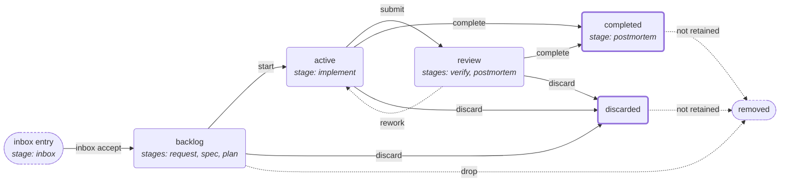

# TCW — Taxonomy · Capabilities · Work

TCW keeps three things about a software project inside the repository, next to
the code: what the project deals with, what a user can do with it, and what is
being changed. One command-line tool, `tcw`, and an agent plugin for Claude Code
and Codex keep all three in step with the code.

| Component        | Answers                                                 |
| ---------------- | ------------------------------------------------------- |
| **Taxonomy**     | What things does this project deal with?                |
| **Capabilities** | What can a user do with those things?                   |
| **Work**         | What are we changing, and where does each change stand? |

## Contents

<!-- readme-rewrite: unwritten -->

## Problem Statement

Ask three people at a company with twenty repositories what one of those
repositories does, what a user can do with it, and what is being changed in it
right now. You get three different answers, assembled from four different places:
a ticket tracker that knows about work but not about the product, a wiki whose
glossary was last edited two years ago, a `FOLLOWUPS.md` that only grows, and
design documents that stopped matching the code some time back.

None of those places is wrong on purpose. They drift because none of them sits
next to the code, and nothing makes them move when the code moves.

TCW puts all three in the repository. One commit carries a code change and the
description of what it changed, and a reviewer sees both in the same diff.

## Installation

### Plugin

In **Claude Code**:

```
/plugin marketplace add brocef/TCW
/plugin install tcw
```

Or, in the Claude **web app** or **desktop app**, open the plugin directory, add
`brocef/TCW` as a marketplace, and install `tcw` from it — no terminal needed.

**Then start a new session.** The plugin installs the `tcw` CLI at session start
by installing `tcw-cli` from PyPI with `pipx`, so one installed mid-session
cannot run until the next one begins. That first session needs network access. It
installs over an existing `pipx install tcw-cli` rather than beside it, and
leaves a development checkout (`pip install -e .`) alone. If `tcw` goes missing
anyway, `pipx install tcw-cli` is the whole fix — the **`tcw-setup`** skill
carries the cases where it is not.

In **Codex**:

```bash
codex plugin marketplace add brocef/TCW --ref main
codex plugin add tcw@tcw
```

Codex has no session-start hook, so ask the agent to run the **`tcw-setup`**
skill — it runs the same install script Claude runs automatically.

The plugin ships the skills and read-only review agents described in
[Skills and Agents](#skills-and-agents).

### CLI

```sh
pipx install tcw-cli
```

Use this when you want the CLI without an agent harness at all. The PyPI package
is named **`tcw-cli`** because `tcw` was taken by an unrelated project; the
command it installs is still `tcw`.

Requires **Python ≥ 3.11** (its only runtime dependency is PyYAML). `tcw serve`
additionally requires **Node.js ≥ 22.12**; every other command is Python-only.
Released wheels carry the prebuilt web assets, so there is no frontend build step
and no network needed after install.

### Cloud Environment Instructions

A cloud agent session — Claude Code on the web, a Codex cloud task, a CI job —
starts from a clean image and is thrown away when it ends, so a `tcw` you install
by hand is gone by the next one. Install it as part of the environment's own
setup, and every session gets it without anyone remembering to.

**Claude Code on the web.** Add a script to your repository:

```sh
#!/usr/bin/env bash
# Make `tcw` available in a disposable agent container.
# Exit 0 on every path — a session must start even when this cannot finish.
set -u

command -v tcw >/dev/null 2>&1 && exit 0

# pipx where it exists; otherwise install into the container's own interpreter.
# That is the right answer *here* and nowhere else: the container is disposable
# and single-purpose, so there is no user environment to damage.
if command -v pipx >/dev/null 2>&1; then
    pipx install tcw-cli >/dev/null 2>&1 || echo "tcw: pipx install tcw-cli failed"
elif ! python3 -m pip install tcw-cli >/dev/null 2>&1 &&
    ! python3 -m pip install tcw-cli --break-system-packages >/dev/null 2>&1; then
    echo "tcw: pip install tcw-cli failed — the tcw CLI is not available."
fi

# An install that landed outside PATH is installed and unusable. $CLAUDE_ENV_FILE
# is the harness's own channel for repairing that.
if ! command -v tcw >/dev/null 2>&1 && [ -n "${CLAUDE_ENV_FILE:-}" ]; then
    userbin="$(python3 -m site --user-base 2>/dev/null)/bin"
    [ -x "$userbin/tcw" ] && echo "export PATH=\"$userbin:\$PATH\"" >>"$CLAUDE_ENV_FILE"
fi

exit 0
```

Then wire it to `SessionStart` in your repository's `.claude/settings.json`:

```json
{
    "hooks": {
        "SessionStart": [
            {
                "hooks": [
                    {
                        "type": "command",
                        "command": "\"${CLAUDE_PROJECT_DIR}\"/scripts/tcw_session_setup.sh"
                    }
                ]
            }
        ]
    }
}
```

Three things make the difference between a hook that helps and one that wastes a
session:

- **Exit 0 on every path, and print only on failure.** A hook that fails the
  session start over a missing CLI has cost more than the CLI was worth.
- **Print to stdout.** Claude Code adds a `SessionStart` hook's stdout to the
  agent's context, where it will be read; stderr becomes a transcript notice
  nobody sees.
- **Check for `tcw` first.** The hook runs every session, including the ones
  where a previous install is still there.

**Codex cloud.** A Codex cloud environment does not read a hook from your
repository. Its install steps go in the environment's **setup script**, which you
set in the environment's settings. Two things differ from Claude Code:

- **The setup script has internet access; the agent does not, by default.**
  Install `tcw` in the setup script, not by asking the agent to do it later.
- **The setup script runs in its own shell**, so an `export` there never reaches
  the agent. Repair `PATH` by writing to `~/.bashrc` instead.

```sh
if ! command -v tcw >/dev/null 2>&1; then
    if command -v pipx >/dev/null 2>&1; then
        pipx install tcw-cli
    else
        python3 -m pip install tcw-cli || python3 -m pip install tcw-cli --break-system-packages
    fi
fi

# An install that landed outside PATH: make the agent's shell find it.
userbin="$(python3 -m site --user-base 2>/dev/null)/bin"
if ! command -v tcw >/dev/null 2>&1 && [ -x "$userbin/tcw" ]; then
    echo "export PATH=\"$userbin:\$PATH\"" >>~/.bashrc
fi
```

**If your work store lives in another repository**, the container holds only the
repository it cloned, so the board is declared but absent. Run `tcw provision`
after the install — it obtains what the checkout does not have, and does nothing
on a machine that already holds it. See
[Working across repositories](docs/guide/multi-repo.md).

Installing the **plugin** in a Claude Code session is a separate step from
installing the CLI, and only needed where the harness does not carry your plugins
in: append `claude plugin marketplace add brocef/TCW` and
`claude plugin install tcw@tcw` to the same script, guarded on `command -v claude`.

## Overview

TCW describes a project along three axes. **Taxonomy** is the project's
vocabulary and its features. **Capabilities** are the things a user can do,
each with a status. **Work** is the set of changes being made, each moving through
a lifecycle. The three link by one-directional pointers: a capability names the
taxonomy entries it involves, and a work item names the capabilities it changes.
None of them copies another's content.

Everything is plain files in the repository, so a code change and the
description of what it changed travel in the same commit and the same pull
request. A work item's status is the folder it sits in, so there is no separate
ledger to fall out of step.

**One command-line tool, `tcw`**, does everything:

| Command            | What it does                                                                  |
| ------------------ | ----------------------------------------------------------------------------- |
| `tcw init`         | marks a directory as a TCW project and creates the folders for each axis      |
| `tcw provision`    | fetches a work store this project declares but this machine does not have     |
| `tcw validate`     | checks every file, reference and link across the project and its sub-projects |
| `tcw serve`        | starts a local web app for browsing and editing all three axes                |
| `tcw taxonomy`     | the vocabulary and features                                                   |
| `tcw capabilities` | what a user can do                                                            |
| `tcw work`         | the changes, and the lifecycle each one follows                               |

A repository adopts TCW with one command, run inside a git repository:

```sh
tcw init --id my-project                # all three axes
tcw init --id my-project taxonomy work  # …or only some of them
```

That writes a `tcw-config.yaml` holding the project's ID and creates the folders
under `docs/`. A project can adopt the work axis alone and add the others later.
`tcw validate` exits non-zero on any problem, so it works as a check in CI.

**The CLI enforces the rules; the agent plugin supplies the judgment.** Legal
status changes, references that must resolve, and the checks before an item can
be completed are enforced by `tcw` itself. Deciding what a request means, writing
a spec, or judging whether work is finished is what the plugin's skills guide an
agent through. See [Skills and Agents](#skills-and-agents).

**Many repositories, one model.** Projects are identified by ID, never by path.
A project can connect to others, inherit their taxonomy and capabilities, and
address their work items as `<project-id>/<slug>`. A checkout holding only some of
the connected repositories still works: the absent ones drop out rather than
breaking your commands. See [Working across repositories](docs/guide/multi-repo.md).

## Taxonomy

### Overview

A taxonomy entry has one of two kinds. **Vocabulary** entries are the project's
basic language: `Invoice`, `Customer`, `Permission`. **Feature** entries are the
user- or application-facing parts that operate on that vocabulary, and each names
the vocabulary entries it involves. A feature can only name vocabulary that
already exists, so vocabulary is registered first.

Entries form a tree, and an entry's path is its address: `admin/permission` and
`billing/permission` are two different entries.

A project can **inherit** another project's taxonomy. Inherited entries keep the
other project's ID as a prefix, so an inherited `acme/permission` never quietly
becomes your own `permission`.

### Usage

#### Skills

| Skill                                          | What it does                                                                                              |
| ---------------------------------------------- | --------------------------------------------------------------------------------------------------------- |
| [`tcw-taxonomy`](skills/tcw-taxonomy/SKILL.md) | Guides an agent through declaring vocabulary and features, linking them, and resolving inherited entries. |

To draft a first taxonomy from an existing codebase, use the `tcw-setup` skill
described in [Skills and Agents](#skills-and-agents).

#### CLI

| Command                | What it does                                                          |
| ---------------------- | --------------------------------------------------------------------- |
| `tcw taxonomy init`    | creates `docs/taxonomy/` (the same as `tcw init taxonomy`)            |
| `tcw taxonomy list`    | shows every entry as a tree, marked by kind and by where it came from |
| `tcw taxonomy add`     | creates a vocabulary entry or a feature                               |
| `tcw taxonomy show`    | prints one entry                                                      |
| `tcw taxonomy path`    | prints the folder the taxonomy is stored in                           |
| `tcw taxonomy rm`      | removes a local entry                                                 |
| `tcw taxonomy search`  | searches entry names and descriptions                                 |
| `tcw taxonomy check`   | checks that every reference and inherited project resolves            |
| `tcw taxonomy extends` | adds or removes a project whose taxonomy this one inherits            |

```sh
tcw taxonomy add Invoice "A bill issued to a customer."   # vocabulary by default
tcw taxonomy add Admin "Running the service."
tcw taxonomy add Permission -p admin                      # → admin/permission
tcw taxonomy add "PDF Export" --kind feature --vocab invoice
tcw taxonomy list
tcw taxonomy extends add acme-shared                      # inherit another project
```

More in [Taxonomy and Capabilities](docs/guide/taxonomy-and-capabilities.md).

## Capabilities

### Overview

A capability is one thing a user can do, such as "Download an invoice as PDF".
Each is addressed by a path (`billing/invoices`), gets a stable ID when created,
and carries a **status**: `Supported`, `Partial`, `Missing`, `Blocked` or
`Omitted`. The status is what makes the list useful: it says what the product
actually does today, and completing a work item is how a capability moves from
`Missing` to `Supported`.

Capabilities can be **inherited** from another project. A web frontend and a
mobile app that drive the same server declare their shared capabilities once, and
each **overrides** only what differs, for example marking one `Omitted` or adding
to its description. An override can be undone to go back to the inherited
version.

#### Relationship to Taxonomy

A capability points at taxonomy, never the other way. Its `Subject` field names
the vocabulary entries it involves (any number of them), and its `Feature` field
names the taxonomy feature that delivers it. TCW checks that both resolve, and
refuses to save a capability whose references do not, so a feature is
registered in the taxonomy before a capability names it.

### Usage

#### Skills

| Skill                                                  | What it does                                                                                                                                                          |
| ------------------------------------------------------ | --------------------------------------------------------------------------------------------------------------------------------------------------------------------- |
| [`tcw-capabilities`](skills/tcw-capabilities/SKILL.md) | Guides an agent through checking a planned change against the existing capabilities, catching contradictions, and updating a capability's status when work completes. |

#### CLI

| Command                    | What it does                                                                                |
| -------------------------- | ------------------------------------------------------------------------------------------- |
| `tcw capabilities init`    | creates `docs/capabilities/` (the same as `tcw init capabilities`)                          |
| `tcw capabilities list`    | lists capabilities, marked by status and by where they came from                            |
| `tcw capabilities show`    | prints one capability                                                                       |
| `tcw capabilities path`    | prints the folder capabilities are stored in                                                |
| `tcw capabilities add`     | creates a capability                                                                        |
| `tcw capabilities set`     | changes a capability's status or fields; on an inherited one, writes an override            |
| `tcw capabilities reset`   | removes a local override, going back to the inherited version                               |
| `tcw capabilities rm`      | removes a local capability                                                                  |
| `tcw capabilities search`  | searches names and descriptions                                                             |
| `tcw capabilities extends` | adds or removes a project whose capabilities this one inherits                              |
| `tcw capabilities check`   | checks paths, fields, taxonomy references and inheritance                                   |
| `tcw capabilities drift`   | reports inherited capabilities nobody has reviewed, and shipped work still marked `Missing` |

```sh
tcw capabilities add billing/invoices "Download an invoice as PDF"
tcw capabilities set billing/invoices --field "Subject=invoice" --field "Feature=pdf-export"
tcw capabilities list --status Missing
tcw capabilities set billing/invoices --status Supported
tcw capabilities extends web-frontend                    # inherit another project
```

More in [Taxonomy and Capabilities](docs/guide/taxonomy-and-capabilities.md).

## Work

### Overview

The work axis tracks every change being made to the project: new product
behavior, changes to its internals, or changes to how the project itself runs.

- **A work item is a folder**, `docs/work/<status>/<slug>/`, holding the
  documents written for it as it moves along. **Its status is the folder it is
  in**: moving an item is a `git mv`, and `ls docs/work/active/` is the board of
  what is in progress. By default, every status change commits itself.
- **Requests start in an inbox.** A raw request dropped into `docs/work/inbox/`,
  by a person or by another project, becomes a work item when it is accepted.
  A Jira ticket can instead become an item directly (see
  [Jira integration](#jira-integration)).
- **Tags** come from a list the project registers (`tcw work tags`), so a typo
  never quietly creates a new tag.
- **Blockers** are recorded on an item (`tcw work edit --blocked-by`). An item
  with an unresolved blocker cannot start, or be completed as done, without
  `--force`; there is no separate "blocked" status.
- **Large items split.** A child item lives inside its parent's folder and moves
  with it. An **epic** groups related items, including items in other
  repositories, and rolls their status back up.
- **Completing is checked.** `tcw work complete` prints the project's Definition
  of Done (a list you set in `docs/work/dod.yaml`) and refuses until you confirm
  it, while blockers are unresolved, or while declared capability changes are not
  yet made.
- **Code can be isolated.** `tcw work start --worktree` gives the item its own git
  branch and worktree, and `complete` merges it back.

The full reference, including every command's options, is
[The Work component](docs/guide/work.md).

#### Relationship to Capabilities and Taxonomy

A work item that changes what a user can do says so in a `capabilities.yaml` file
in its folder, listing capability paths under `new:`, `changed:` and `removed:`.
That is the pointer from work to capabilities. `tcw work complete` refuses while
a capability listed as `new:` is still `Missing`, a listed path does not exist,
or a `removed:` capability is still there. So the capabilities list always
describes what has actually shipped.

Work reaches taxonomy through those capabilities: a new capability names the
vocabulary and feature it involves, and those entries must exist first. The
planning skills check both, in that order (vocabulary, then features, then
capabilities, then the work itself), before a change is designed.

### Lifecycle

TCW's lifecycle has two separate parts. **Stages** produce documents: `request`
writes `initial-request.md`, `spec` writes `spec.md`, and so on. **Transitions**
move an item from one status to another. Nothing is both. In words: an inbox
entry is accepted into the backlog, where the request, spec and plan are written;
`start` moves it to active for implementation; `submit` moves it to review for
verification, from which `rework` can send it back; and `complete` finishes it as
completed, or as discarded if it will not ship.



The stages, and the document each one writes:

| Stage        | Runs while the item is | Writes                                                            |
| ------------ | ---------------------- | ----------------------------------------------------------------- |
| `inbox`      | not yet an item        | nothing; it creates the item, keeping the raw text as `intake.md` |
| `request`    | backlog                | `initial-request.md`: what is asked for, and why                  |
| `spec`       | backlog                | `spec.md`: what to build, with acceptance criteria                |
| `plan`       | backlog                | `plan.md`: how to build it, as ordered tasks                      |
| `implement`  | active                 | `outcome.md`: what was built, and what the plan got wrong         |
| `verify`     | review (or active)     | `refined-outcome.md` if accepted, `rework.md` if not              |
| `postmortem` | review or completed    | `post-mortem.md`: which stage could first have caught a problem   |

The transitions, and what each one checks before it moves an item:

| Transition   | Command                                                                          | Moves                                 | Refuses when                                                                                                                              |
| ------------ | -------------------------------------------------------------------------------- | ------------------------------------- | ----------------------------------------------------------------------------------------------------------------------------------------- |
| `start`      | `tcw work start <slug>`                                                          | backlog → active                      | a blocker is unresolved; the item belongs to an epic that is not active                                                                   |
| `submit`     | `tcw work submit <slug>`                                                         | active → review                       | never                                                                                                                                     |
| `rework`     | `tcw work rework <slug>`                                                         | review → active                       | `refined-outcome.md` is present (it says the work was accepted)                                                                           |
| `complete`   | `tcw work complete <slug> --resolution done --confirm`                           | review or active → completed          | a blocker is unresolved; an epic has open children; declared capabilities are not reconciled; a worktree merge-back fails; no `--confirm` |
| discard      | `tcw work complete <slug> --resolution wontfix\|duplicate\|superseded --confirm` | backlog, active or review → discarded | no `--confirm`                                                                                                                            |
| `drop`       | `tcw work drop <slug> --confirm`                                                 | backlog → removed                     | the item is not in backlog; no `--confirm`                                                                                                |
| not retained | happens during `complete` or discard                                             | completed or discarded → removed      | only happens when `work.retain` says that status is not kept; `tcw work delete` finishes one that was interrupted                         |

`review` means implemented but not yet accepted: an item in review still blocks
the items that depend on it. `rework` is the only move backwards, and nothing ever
leaves `completed` or `discarded`.

A project can attach its own instructions and checks to any stage or transition,
such as a design rule read at `spec` or `tcw validate` run before `complete`. See
[Configuration](docs/guide/configuration.md). `tcw work lifecycle` prints the
whole contract, with whatever the project has attached.

#### Jira integration

<!-- readme-rewrite: unwritten -->

### Usage

#### Skills

<!-- readme-rewrite: unwritten -->

#### CLI

<!-- readme-rewrite: unwritten -->

## Skills and Agents

<!-- readme-rewrite: unwritten -->

## TCW Local Web App

<!-- readme-rewrite: unwritten -->

## Documentation

<!-- readme-rewrite: unwritten -->

## Development

### Setting up

<!-- readme-rewrite: unwritten -->

### Running the tests

<!-- readme-rewrite: unwritten -->

### How work is tracked here

<!-- readme-rewrite: unwritten -->

### Measuring the skill layer

<!-- readme-rewrite: unwritten -->

### Releasing

<!-- readme-rewrite: unwritten -->

### Reporting problems

<!-- readme-rewrite: unwritten -->

### License

<!-- readme-rewrite: unwritten -->

## Further Reading

<!-- readme-rewrite: unwritten -->
