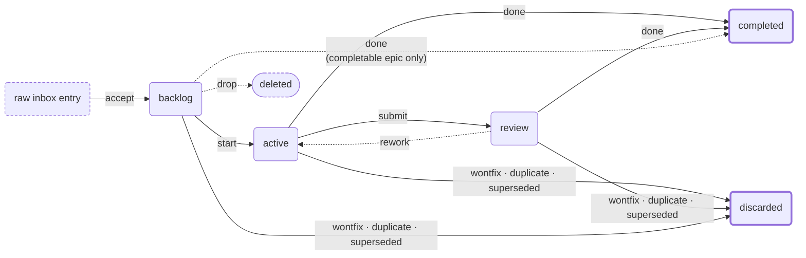

# The Work component

Work items are the change layer: edits to capabilities (product), to machinery
(technical), or to the project itself (meta). Status is the folder an item lives
in, and a transition is a `git mv`.

See also [Taxonomy and Capabilities](taxonomy-and-capabilities.md),
[Configuration](configuration.md), and [Working across repositories](multi-repo.md).

## The state machine

Raw requests enter through a permissive inbox, then accepted requests become
formal work in a **single-node state machine** where status is the folder a work
item lives in and a transition is a move between folders:



Each of the four solid boxes is a status, and therefore a folder. The two dashed
boxes are not: an inbox entry is a raw file that has not become an item yet, and
a dropped item is gone. Every edge into `completed` or `discarded` is
`tcw work complete --resolution <r>`, labelled here by the resolution; the dashed
edges are the exceptions to the ordinary forward path.

The **resolution picks the destination**, so `completed/` answers "what
shipped?" on its own. A backlog item can be discarded directly — abandoning an
idea never needed a throwaway `start`.

`review` means **implemented, acceptance pending**. It is not a finished state:
an item sitting in review still blocks whatever depends on it and still holds
its epic open, because verification can send it back. `rework` is the only
reverse move in the machine — nothing ever leaves `completed/` or `discarded/`.

Review is **optional**. A small change can still go straight from `active` to
`completed`; `tcw work complete` just prints a note saying the verify step was
skipped, and completes.

Blocked-ness is a **derived overlay**: an item is blocked when it has at least
one unresolved blocker recorded in its data — there is no separate "blocked"
folder or status.

## References to work that is finished

Resolving an item takes its documents out of the tracked tree, so a
`tcw://W/<slug>` link to it would have nothing to resolve against. Completing
and discarding therefore **record the slug**, in `graveyard.yaml` beside the
status folders, and the record rides the same commit as the status change. A
reference to finished work then keeps resolving: `tcw validate` says nothing
about it, and `tcw serve` shows it inert rather than broken. A reference to a
slug the project never held is still an error, in the same words as before —
that distinction is the whole point of the record.

The record says the slug existed and how it was resolved. It deliberately does
**not** say where the documents went: any such pointer stops working the moment
history is squashed, rebased, or shallowly cloned, and a pointer that quietly
breaks is worse than none. How long resolved documents are kept stays your
call — `completed/` and `discarded/` are gitignored by default, and a project
that wants them in the tracked tree simply does not ignore them.

For work resolved **before** your project kept these records — including
everything resolved before this feature existed — record a slug by hand:

```bash
tcw work tombstone add <slug> --resolution done --resolved 2026-09-01
```

Both flags are optional; omit them when nobody kept the detail, since the
record's job is to say the slug existed.

Run it wherever you are — including on the machine that resolved the work, where
the item's folder is usually still sitting on disk. It refuses only a slug that
is _live_, and a slug already in the graveyard, so re-running it over a list is
safe and will not quietly replace a good record with a blank one. It commits
what it writes, and on a store with a configured remote it publishes too, since
a record nobody else can see does not do its job.

## What happens to resolved work

Three arrangements, and a project picks one per resolved status.

**Gitignored** is what scaffolding gives you and what every existing project
has: `tcw work init` writes `.gitignore` rules for `docs/work/completed/` and
`docs/work/discarded/`, keeping each folder's `.gitkeep` tracked. A resolved item
is untracked and left on disk, so it stays with the person who resolved it —
and, worth knowing, reaches nobody else. A fresh clone has no resolved items at
all.

**Retained** tracks them: delete the rules, and `git rm -r --cached
docs/work/completed docs/work/discarded` to drop what git already has.

**Auto-deleted** removes the folder and keeps the content in history:

```yaml
work:
    retain:
        completed: false # default: true, for both resolved statuses
        discarded: false
```

The resolving transition then writes **two commits** — the item lands in its
resolved folder and is committed, then the folder is removed — and the
graveyard entry records the first commit, so `tcw work show <slug>` on a
resolved item reports where its documents can still be fetched from. Nothing is
deleted unless you ask: the default retains everything, and a malformed
`retain` reads as the default and is reported by `tcw validate` rather than
quietly becoming a deletion.

**Auto-delete and the ignore rules cannot coexist**, and TCW refuses the
combination before anything moves. Git untracks rather than moves a path into an
ignored folder, so the first commit would record a removal and hold no item —
leaving the record pointing at a commit that never contained anything, and no
copy anywhere. Removing the rules is a precondition, not a companion change. Once
a status is named in `retain`, `tcw work init` stops writing rules for it.

**Hand the item to your own archive before it goes.** The removal is a bindable
lifecycle step, `auto-delete`, with `pre` and `post`:

```yaml
work:
    retain:
        completed: false
    lifecycle:
        transitions:
            auto-delete:
                pre:
                    - command: tar -czf - -C "$TCW_ITEM_PATH" . |
                          aws s3 cp - "s3://my-bucket/$TCW_RESOLUTION/$TCW_SLUG.tgz"
```

`pre` runs after the item is committed where it landed and before it is removed,
so your command sees a complete artifact that is already recorded. Two variables
join the usual four: `TCW_ITEM_PATH`, the store's own answer for where the item
is at the moment the hook runs, and `TCW_RESOLUTION`. Both are set on any
transition that has them — `TCW_ITEM_PATH` on all of them — and omitted rather
than blank when they do not, so a script can test for presence. **If your command fails, the item is not deleted** — it
stays resolved, recorded and committed, and `tcw work delete <slug>` finishes the
removal once you have fixed things. A command that moves the item away itself is
fine; an already-absent folder counts as removed.

Two things this does not promise. TCW cannot tell whether your command really
archived anything, and a `skill:` binding is reported for your agent to invoke
rather than run — so anything you need guaranteed belongs in a `command:`.
`tcw serve` runs no hooks, so an item resolved through the web UI waits for a CLI
`tcw work delete` rather than being removed without your archive.

Adopting auto-delete on an older board wants one more step first: the graveyard
is what keeps a deleted slug from being reissued, and a board that predates it
has none. `tcw work tombstone add <slug>` backfills the ones already resolved.

A history that gets rewritten takes the content with it. A squash-merge or a
shallow clone can leave a record whose commit no longer resolves — `tcw work
show` says so rather than printing a dead pointer, but it cannot get the content
back. That is the trade auto-delete makes, and it is why the default does not
make it for you.

## Transitions and commits

**Every transition commits its own move.** `tcw work start`, `submit`, `rework`,
and `complete` each leave a commit recording just that item's status change —
scoped to the item's own folders, so unrelated edits in your working tree are
never swept in. Set `work.auto-commit-transitions: false` in `tcw-config.yaml` to
turn it off and commit them yourself. `work.trunk-branch: main` adds a warning
when you transition an item from some other branch; it is advisory only and
never checks anything out.

## The Definition of Done

**The completion checklist is yours to set.** `tcw work complete --resolution
done` prints a Definition of Done and refuses until you re-run with `--confirm`.
Write your own as a plain list in `docs/work/dod.yaml`:

```yaml
- tests pass
- docs synced
- capabilities reconciled
- reviewed
- version offered
```

Two things to know. The file **replaces** the built-in list rather than adding to
it — those five are the defaults, so a list that leaves one out drops that check
from every completion, with no error. And it is printed only when the resolution
is `done`: discarding an item (`wontfix`, `duplicate`, `superseded`) prints no
checklist at all, so a line meant to cover those closures has nowhere to land.

If the item came from a GitHub issue — `/tcw-triage-issues` records it — closing
the item out means answering that issue and usually closing it too. A checklist
line is the natural place to be reminded.

## Command reference

```sh
tcw work init                          # docs/work/{inbox,backlog,active,review,completed,discarded}/

tcw work inbox list                    # list each raw file or folder entry
tcw work inbox show request.md         # inspect metadata, text, and resource manifest
tcw work inbox accept request.md       # consume it into a new backlog item; print the slug
tcw work inbox accept request            # …or the bare title `inbox list` printed, same entry
tcw work inbox accept request.md --title "Clear title"

slug=$(tcw work new "Add PDF export")  # creates a backlog item, prints its slug
tcw work new "Add PDF export" --blocked-by other-slug --blocked-by "external: JIRA-123"
                                       # create with blockers pre-attached (flag is repeatable —
                                       # one blocker per flag, so its text may contain commas)
tcw work new "Urgent fix" --priority 5 # integer priority (higher = higher); default unspecified
tcw work new "Big rework" --effort high --complexity very-high
                                       # optional estimates (low|medium|high|very-high; L/M/H/VH shorthand ok)
tcw work new "Sub-task" --parent "$slug"  # a child item, nested inside the parent's folder

tcw work tags add bug tech-debt        # register a project's valid tags (in tcw-config.yaml)
tcw work tags list                     # print the registered tags
tcw work tags rm tech-debt             # unregister (warns about items still carrying it)
tcw work new "Login crash" --tag bug   # apply a registered tag (repeatable; unregistered → error)

tcw work list                          # the board: priority first, then topologically ordered
                                       # (hides completed and discarded)
tcw work list --status active          # filter to one column (backlog|active|review|completed|discarded)
tcw work list --tag bug                # only items carrying a tag (repeatable = match any)
tcw work list --all                    # include completed and discarded items too
tcw work list --status discarded       # only the items closed without shipping
tcw work list -i                       # descendant boards; --incl-desc and --include-descendants are aliases
tcw work lifecycle                     # the stage/transition contract + this node's bindings
tcw work docs [--json]                 # the documents this project keeps in sync with code
tcw work lifecycle --json              # the same, machine-readable
tcw work lifecycle --stage spec --directive
                                       # one instruction line for an agent, or nothing if unbound

tcw work show "$slug"                  # state + body (includes blocked_by/type/initiative/effort/complexity/tags if set)
tcw work show "$slug" --json           # the item as a versioned JSON document

tcw work stage spec "$slug"            # what to do at this stage: checks, then instructions
tcw work stage spec "$slug" --no-exec  # what *would* run, running none of it

tcw work scaffold spec "$slug"         # write spec.draft.md from its template — a starting
                                       # point to type into, never the spec itself
tcw work scaffold spec "$slug" --force # replace a draft you already have
tcw work path                           # absolute, resolved work-store folder
tcw work path "$slug"                  # current filesystem path of the slug
tcw work inbox path                     # absolute, resolved inbox folder

tcw work start "$slug"                 # backlog → active (refused if blocked/gated)
tcw work start "$slug" --force         # override unresolved blockers or initiative gates

tcw work submit "$slug"                # active → review (implemented, acceptance pending)
tcw work rework "$slug"                # review → active (verification rejected the work;
                                       # refused while refined-outcome.md still says it passed)

tcw work edit "$slug" --blocked-by other-slug    # record a new blocker (repeatable)
tcw work edit "$slug" --blocks downstream-slug   # this item now blocks another
tcw work edit "$slug" --unblocked-by other-slug  # clear a resolved blocker (repeatable;
                                                 # accepts the "external: …" form show/list print,
                                                 # and fails if it matches no blocker)
tcw work edit "$slug" --title "A better title"   # rename the item (the slug never changes)
tcw work edit "$slug" --priority 9               # set/raise integer priority
tcw work edit "$slug" --effort medium --complexity low   # set effort/complexity estimates
tcw work edit "$slug" --tag bug --untag stale    # apply/remove tags (repeatable)

tcw work complete "$slug" --resolution done --confirm
tcw work complete "$slug" --resolution done --confirm --force   # override blockers, gates, or unreconciled capabilities
tcw work complete "$slug" --resolution done --confirm --already-integrated
                                       # the work branch was merged outside TCW (a merged PR):
                                       # skip the merge-back, keep every other gate
tcw work complete "$slug" --resolution wontfix --confirm        # → discarded/ (no Definition of Done; legal from backlog)
tcw work drop some-slug --confirm      # erase a mis-created item, leaving no record
```

`complete` **enforces capability reconciliation**: if the item's `capabilities.yaml`
declares a `new:` capability that still reads `Missing`, or any declared path that
no longer resolves, the completion is refused (flip it with `tcw capabilities set`,
mark it `Omitted`, or `--force` past). For a `--worktree` item the check runs after
the branch merges back, so a status flip made on the work branch counts.

A **discard is not a shipment**, so none of the shipping gates apply to one: no
Definition-of-Done checklist, no capability enforcement (just a warning naming
anything left `Missing`), no branch merge-back, and **no blocker check** — being
blocked indefinitely is one of the best reasons to give up on something, so
needing `--force` to act on it would be backwards. `--confirm` is still
required, since closing is permanent. Discarding a `--worktree` item tears down
the worktree but **keeps the unmerged branch**, naming it so you can delete it
deliberately — deciding work isn't wanted is not the same as authorizing its
destruction.

An **epic** is the one exception: open initiative children block closing it by
either route, because a child can't start until its epic is active, so closing
the epic would strand them.

## Tags

**Tags** classify items for filtering. Each project registers its valid tag set
centrally in `tcw-config.yaml` (`tcw work tags add|rm|list`); an item then carries
zero or more of those tags via `--tag` on `new`/`edit` (and `--untag` to remove).
Applying an unregistered tag is refused, and `tcw validate` flags any item still
carrying a tag that was later unregistered. Tags don't affect board ordering.

After `tcw work new` and `tcw work start`, the CLI prints the **next transition to
run** (e.g. "→ next: when you begin implementing, run `tcw work start …`") so the
lifecycle is hard to skip — the slug still goes to stdout alone, the hint to stderr.
`tcw work new` also prints an "→ edit: …" line (stderr) pointing at the new
item's body file when it has one — piped stdin lands in `intake.md`, so that is
what the hint points at. Created with nothing piped, an item has no body file
yet and the line is simply omitted.
Every command that moves an item also names where it now lives, as a path
relative to the project root — `tcw work start` and `tcw work complete` on
stdout ("started my-item → docs/work/active/my-item"), `tcw work new` and
`tcw work inbox accept` on stderr beside their other hints, leaving their stdout
the bare slug.
Inbox entries are deliberately permissive. A direct child of `docs/work/inbox/`
may be any standalone file, or a folder with exactly one `INDEX.md` or
`INDEX.txt`; other folder files become bounded `attachments/` on acceptance.
Hidden files and empty directories are ignored, symlinks are not followed, and
binary contents are never printed. See the optional
[`docs/work-inbox-template.md`](../work-inbox-template.md) for a useful request
shape; the command does not require that template, but it does read the first
`# ` heading of an entry's body as the accepted item's title — `--title`, then
that heading, then the entry's own name with a leading `YYYY-MM-DD-` removed
(unless removing it would leave nothing).
Accepting an entry records what arrived as the item's `intake.md` — the entry body, a manifest
naming every preserved resource and the entry it came from, and a note standing
in for a primary resource that is not text — and leaves the item's `request`
stage still to run.

An item's **body surface** resolves to `initial-request.md` when it exists, and
otherwise to `intake.md` — the raw, unprocessed input the item started from
(piped stdin, or an accepted inbox entry with its manifest and attachments).
An item created with neither has no body yet, which is a state rather than a
defect: `initial-request.md` is the `request` stage's own artifact, so it exists
once that stage has run and not before. Presence everywhere means _exists and is
non-empty_.

## Automation and piping

**Piping is safe to automate.** `tcw work new "<title>"` reads intake from
stdin when something is piped in, and a script, CI job, or hook that leaves its
own input open no longer hangs waiting for an end-of-input nobody will send: the
command creates the item without intake and says so on stderr. If text starts
arriving and then stops, the command fails instead of storing the fragment —
half a document kept as `intake.md` would be indistinguishable from one you meant
to write. Set `TCW_STDIN_TIMEOUT` (seconds; `0` never waits) when a producer is
genuinely slow. The same applies to `tcw work delegate`, `tcw work escalate`,
`tcw taxonomy add`, and `tcw capabilities add`.

Editing an item's body always writes `initial-request.md`, never the intake. On
an item that has only intake, that edit **promotes** it — the request is created,
the intake is left byte-for-byte as it arrived, and the tool says a promotion
happened rather than letting it look like an ordinary save. Raw input that
quietly changes is not raw input, so `intake.md` is editable only as a named
artifact.

For large implementations, `plan.md` may optionally declare a bounded DAG of
stage documents in YAML frontmatter. Each declaration has a lowercase kebab-case
`id`, a title, and `depends_on`; optional effort, complexity, priority, and tags
reuse the work item's controlled vocabularies. The corresponding document is
stored as `plan/<id>.md`. This keeps `plan.md` concise so agents can read it
first, then load only the relevant stage. Dependencies communicate ordering and
parallelism but do not create stage statuses or block lifecycle transitions.
Legacy single-file plans remain valid.

The **board** (`tcw work list`) prints a `|`-delimited row per item —
`slug | status | stages | priority | title` (priority is the integer, or `-`
when unspecified). `stages` is a compact lifecycle artifact string: a lowercase `i` for
`intake.md`, then `R` for `initial-request.md`, `S` for `spec.md`, `P` for
`plan.md`, `O` for `outcome.md`, and `F` for `refined-outcome.md`; the letters
read in lifecycle order. Missing or empty artifacts do not contribute letters,
and `-` means no lifecycle artifacts are present — so `R` means the `request`
stage has actually run. The
board shows the live columns (backlog and active) and hides both closed
columns by default — pass `--status completed` or `--status discarded` to list
one, or `--all` for everything.
It sorts by priority first (higher integer above lower, unspecified-priority
items keeping creation order), then topologically — blockers appear before the
items they block, since a priority preference can't jump a hard dependency —
and annotates blocked items with their unresolved blockers.

`tcw work show <slug> --json` prints the item as a machine-readable document
instead of the human-readable summary: an explicit `schema` version, every field
at a documented JSON type, and an `artifacts` map saying which lifecycle
documents exist. It is the same document `tcw serve`'s API returns, so a script
and the web app cannot disagree about what an item is. Errors go to stderr and
leave stdout empty, so piping into `jq` fails cleanly rather than on a fragment.

Pass `-i`, `--incl-desc`, or `--include-descendants` to list every **registered
descendant work node**. The output is grouped by project ID (`# .` for the
current node), and the same `--status` / `--all` filters apply to every group.
Initiative tasks are indented beneath their visible owning epic, including tasks
from descendant nodes; each descendant row keeps its project-qualified slug and
is printed only once.

Descendant items are printed with a **project-qualified slug** —
`<project-id>/<slug>` — so each printed slug is a usable address. You can pass that
qualified slug to any work command from the enclosing node
(`tcw work show project-a/<slug>`, `start`, `edit`, `complete`, `drop`, …).
A **bare** slug still resolves against the current node only. (`blocked-by:`
refs shown on a qualified row stay node-local — they are bare slugs within that
descendant.)

A qualified slug addresses **any node in the registered graph, in any direction** —
descendant, ancestor, or sibling — not just nodes below you. A child project can
therefore address (and link) an epic that lives in its parent. Project IDs are
canonical and connections must be reciprocal, so there is nothing ambiguous to
resolve; an unregistered project, or a path-shaped qualifier such as
`some/folder/<slug>`, still does not resolve. A qualifier that names no registered
project reports `no such project in this graph: <id>` rather than a misleading
"no such work item".

Note that `tcw work list -i` and `tcw serve` remain **descendant-only** — they
aggregate boards downward. Addressing and linking are graph-wide; aggregation is
not.

## Assistant-driven backlog chores

Two backlog chores are **AI-driven reviews rather than CLI commands** — they need
judgment the CLI cannot supply, so the assistant runs them:

**Auditing the backlog** reviews items in board order and reports read-only
cleanup recommendations: likely duplicates or already-finished work, broken file
references, stale blockers, malformed capability deltas, vague items, and items
that look like they belong in another TCW node. It reports evidence and suggested
next actions and asks before changing anything. Ask the assistant to audit the
backlog, or run `/tcw-audit-work-backlog` in Claude Code; the procedure lives in
the `tcw-work` skill, so it works under either harness.

**Consolidating external plans** finds Markdown planning documents outside
`docs/work/` and migrates them into backlog items, writing `initial-request.md`
with the source content and provenance and copying obvious spec/plan sections
into `spec.md` and `plan.md`. It runs only when you ask for it, lists every
source file it proposes to delete before deleting any, and deletes only files git
has already committed — anything untracked or with uncommitted changes is
reported and left alone. Ask the assistant to consolidate external plans, or run
`/tcw-consolidate-plans` in Claude Code; the procedure lives in the `tcw-work`
skill, so it works under either harness.

## Decomposing an item

A large item can be **decomposed into child items** with `tcw work new
"<title>" --parent <slug>`: the child's folder is created inside the parent's,
and `tcw work list` renders children indented under their parent. A child shares
its parent's status by living inside it — starting or completing the parent
carries its children along, while transitioning a child on its own promotes it
to a top-level item. (That keeps any one item small; for work spanning _separate
repos_, use a cross-node epic instead — see below.)

Items are referenced by a **stable slug**, resolved to "wherever it now lives,"
so moves never break references. Only the legal transitions above are permitted
— anything else is refused, not silently allowed.

## The completion gate

**Completion is gated.** `tcw work complete --resolution done` prints the
Definition of Done and refuses without `--confirm` (and without `--force` if
unresolved blockers exist). A discard prints no checklist and is not
blocker-gated, but still refuses without `--confirm`:

```
Definition of Done — acknowledge each item:
  [ ] tests pass
  [ ] docs synced
  [ ] capabilities reconciled
  [ ] reviewed
  [ ] version offered
```

Resolutions are `done · wontfix · duplicate · superseded`. The
"capabilities reconciled" item is the structural link back to the capabilities
axis: a work item declares its capability delta at creation and reconciles it at
completion, so the standing capability ledger stays current by construction.

## Cross-node recursion (epics across repos)

For cross-node discovery (`tcw work nodes` / epics / delegate / escalate), a
**node** is a git repo with a usable work store — `docs/work/` by default, or
wherever its `work.path` points; "orchestrator" and "project" are
relative roles. (The _current node_ — where `tcw` operates day-to-day — is the
nearest `tcw-config.yaml` ancestor, which may be a subfolder.) A node nested
under another is a **child**, the enclosing one its **parent**. An **epic** is
an ordinary work item that tasks in child nodes point at via an
`initiative:` back-pointer.

```sh
tcw work nodes                              # show this node's parent + child nodes

epic=$(tcw work new "Redesign checkout" --epic)
tcw work new "Slice 1" --initiative "$epic" # in a child node: link a new task to the epic
tcw work edit "$slug" --initiative "$epic"  # …or link an existing one

tcw work reconcile "$epic"                  # follow registered descendants → rollup
tcw work reconcile "$epic" --commit         # …and commit it
tcw work reconcile "$epic" --complete-when-ready  # …and auto-close it if every child is resolved

echo "needs an API change" | tcw work delegate child-repo "Expose X"  # request DOWN (child's project id, not a path)
echo "cross-repo scope"    | tcw work escalate "Coordinate the redesign" # request UP to the parent inbox/
```

Claiming an item is atomic, and concurrent commands read across it safely: an
item mid-claim is never mistaken for a missing one, so a blocker being started
elsewhere still blocks. If a process dies holding a claim, reads report an
interrupted claim and point at `tcw work start <slug> --take-over --owner <id>`
rather than pretending the item is gone.

`reconcile` consolidates every child task for an initiative into the epic's
`rollup.md` — a slice table, surfaced capability deltas, and the next ready
actions — and is **read-only** on the capabilities ledger. The rollup is
generated, so it lives in its own file rather than inside a document someone
wrote; an epic that has only ever been reconciled still shows no `R` on the
board. `delegate`/`escalate` only ever write a request into the target node's
`inbox/`, never its tracked work, respecting the node write-boundary — into the
target's _configured_ inbox, and they fail loudly rather than inventing a
`docs/work/` folder when that store cannot be reached. `delegate` addresses its
target by canonical project ID, the form `tcw work nodes` lists — never by
filesystem path. A delegated request's `--initiative` survives acceptance, so a
slice accepted in the child stays linked to the epic that asked for it.

Initiative transitions are relation-gated: a task with `initiative: <epic>` is
refused at `start` until the epic is active, and an epic is refused at
`complete` while related child tasks are still open. `--force` overrides these
gates when the relationship cannot be resolved or the user intentionally
deviates. Once **every** child is resolved, the epic is flagged `ready-to-close`
in `tcw work list` and in its rollup, and it may be completed **directly from
`backlog`** — a coordinator epic that never had its own spec/plan doesn't need a
throwaway `start` just to close it (the Definition-of-Done and capability gates
still apply).

Run an item in an isolated checkout with `--worktree`:

```sh
tcw work start "$slug" --worktree           # active on trunk + a git worktree/branch for the code
```

Status transitions stay on the node's primary checkout (the board is always
`ls active/`); in-flight edits live on the work branch. `complete` merges that
branch back into the primary checkout, then tears the worktree down — and if the
merge conflicts it stops with the branch and worktree left intact, so committed
work is never silently dropped. Moving the item through its lifecycle while the
branch is open is not a conflict: `submit` relocates the item's folder on the
primary checkout, and the merge-back carries the branch's files into the folder's
new home rather than stopping to ask. The same applies to any other directory
renamed on the primary checkout while the branch was open, code included — files
the branch added under the old path follow the rename. With a `work.path` in
another repository the
setup commits split by owner — item state in the store repository, `.gitignore`
in the code one — and the work branch carries the code side only, because one
Git branch cannot contain another repository's files.

Run `complete` **from the primary checkout**, not from inside the item's own
worktree: both the merge-back and the teardown act on the primary checkout, and
`git worktree remove` would be deleting the directory you are standing in. From
inside, TCW refuses and names where to re-run it. Every other command works from
either place.

---
